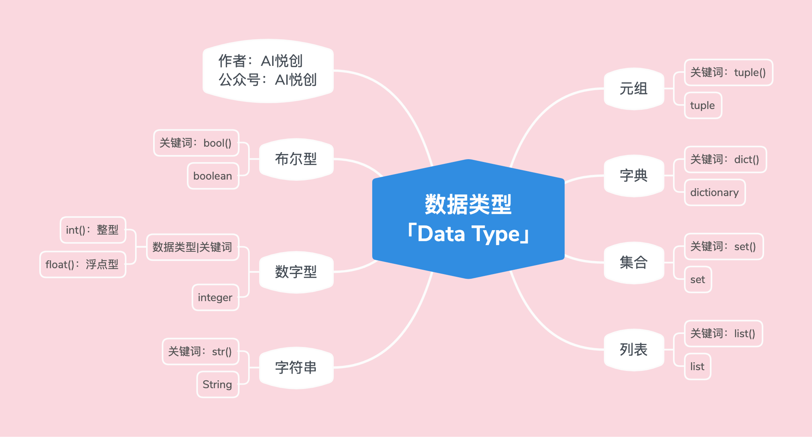

## 数据类型


## 1.数字型「int, float」

### 1.1代码示例

1. 整形

```python
int_num = 1
t = type(int_num)
print(int_num)
print("int num type is: >>>", t)
print("直接检测数据类型并输出", type(int_num))

#output
1
int num type is: >>> <class 'int'>
直接检测数据类型并输出 <class 'int'>
```

2. 浮点型

```python
float_num = 1.1
t = type(float_num)
print(float_num)
print("int num type is: >>>", t)
print("直接检测数据类型并输出", type(float_num))

#output
1.1
int num type is: >>> <class 'float'>
直接检测数据类型并输出 <class 'float'>
```


## 2.字符串「str」

### 2.1 代码示例

```python
string = "Vervevividness"
t = type(string)
print(string)
print("int num type is: >>>", t)
print("直接检测数据类型并输出", type(string))

#output
Vervevividness
int num type is: >>> <class 'str'>
直接检测数据类型并输出 <class 'str'>
```

### 2.2 字符串的三大特性

1. 有序性

    1. 「从左到右，下标是从0开始」；

    2. 「从右到左，下标是从-1开始」

    3. 引号里面出现的都算一个下标（空格也算）；

2.  不可变性

    1. 字符串被创建出来后，就不能被改变；

    2. **注意⚠️**：不可变是指在代码运行的过程当中，不能对字符串修改，添加，删除之类的操作。	

3.  任意字符：
    1. 键盘上可以输入的字符，都可以是字符串的元素
    2. 字符放到字符串中，都将成为字符串类型。「也就是：里面的每一个元素都可以称为：子字符」


## 3. 列表

### 3.1 代码示例

```python
lst = ["Vervevividness", 1, 0.1, ("happy", "sad", 31), [31, "bones"], True, False]
t = type (lst)
print(lst)
print("lst type is:>>>", t)
print("直接检测数据类型，并输出:>>>", type(lst))

#outcome
['Vervevividness', 1, 0.1, ('happy', 'sad', 31), [31, 'bones'], True, False]
lst type is:>>> <class 'list'>
直接检测数据类型，并输出:>>> <class 'list'>

```


### 3.2 列表的三大特性

1. 有序性

    1. 「从左到右，下标是从0开始」；

    2. 「从右到左，下标是从-1开始」

    3. 列表里的每个元素算一个；

        eg. `lst = ["Hello", 31]` ;

        1. `Hello`是下标0（从左到右），也是下标-2（从右到左）；

        2. `31`是下标1（从左到右），也是下标-1（从右到左）；

2. 可变性：在程序运行的过程中，列表可以「添加，删除，修改」
3. 任意数据类型：注意⚠️，这里说的任意数据类型，指的是python所拥有的数据类型；

::: details Python 所拥有的数据类型「下面只包含了基础类型」



:::

## 4. 元组「tuple」

### 4.1 代码示例

```python
tup = (1, 2, 3, 4, "Hello", 1.1, [1, 2, 3, 4])
t = type(tup)
print(tup)
print("tup type is :>>>", t)
print("直接检测数据类型，并输出:>>>", type(tup))

#output
(1, 2, 3, 4, 'Hello', 1.1, [1, 2, 3, 4])
tup type is :>>> <class 'tuple'>
直接检测数据类型，并输出:>>> <class 'tuple'>
```

1. 有序性

    1. 「从左到右，下标是从0开始」；

    2. 「从右到左，下标是从-1开始」

    3. 元组里的每个元素算一个；

        eg. `lst = ["Hello", 31]` ;有两个元素

        1. `Hello`是下标0（从左到右），也是下标-2（从右到左）；

        2. `31`是下标1（从左到右），也是下标-1（从右到左）；

2. 不可变性
    1. 元组被创建出来之后，就不能被改变；
    2. 注意⚠️：不可变，是在代码运行的过程中，不能对元组修改，添加，删除之类的操作；

3. 任意数据类型：注意⚠️，这里的数据类型，指的是python所拥有的数据类型


## 5. 探究👀列表&元组

::: info 为什么🧐有列表后，还需要元组

列表和元组到底用哪一个呢？

:::

1. 如果存储的数据或数量是可变的，比如社交平台上的一个日志功能，是统计一个用户在一周之内看了哪些用户的帖子——那么则用列表更合适。
2. 如果存储的数据和数量不变，比如你有一个系统（软件），需要返回的是一个地点的经纬度，然后直接传给用户查看——那么肯定选用元组更合适。

- **假设**

    - 假设1：现在有一个仓库，你要向仓库添加物品。仓库很大，现有的物品也很多，你不知道还有没有位置可以存放。此时我们是不是需要聘请一个仓库管理员，这样我们就可以直接问仓库管理员：里面还有哪个位置（是否有位置？）仓库管理员会告诉你，并且你可以直接把你的物品，添加进去。

        问题来了，仓库管理员为什么知道仓库是否有位置？——因为仓库管理员会一直跟踪这个仓库的状态；

    - 假设2：现在有一个原子弹的仓库，仓库创建之后，只能存放一个原子弹。那么，我们需要设立一个专门的人员跟踪：原子弹仓库的状态吗？——不需要，此时在聘请一个就显得浪费了。（不然，领导没油水了～hhhhh）

- **Why？**

    - 用户日志📔，是不是会一直变动（记录📝看了哪些帖子），我们是不是需要有一个类似仓库管理员的“人”，来跟踪并且知道：是否有位置（是否有空间/内存），还需要知道在哪里添加。——列表更合适，因为列表可变。「可变意味着：添加、删除、修改」
        - 元组为什么不合适？——因为，你每当需要添加数据的时候，就得重新创建一个新的元组。（就类似于：你创建原子弹的仓库，肯定是刚刚好可以存放一个，那么你想存放两个的时候，只能重新再创建一个仓库。）
    - 经纬度会改变吗？显然是不会的，那么就不需要一个多余的“人”去跟踪状态。——用列表可以吗？可以！但是没必要。「因为我们不需要仓库管理员」用列表有点浪费资源了。元组的功能刚刚好够用。
    - **<span style="color:orange">我们讲究：不浪费，合适就好。</span>**

## 6. 字典「dict」

### 6.1 代码示例

```python
d = {"name": "Cindy", "age": 17, 1: "int", 1.1 : 1, "tup" : (1, 2, 3)}
t = type(d)
print(d)
print("d type is :>>>", t)
print("直接检测数据类型，并输出:>>>", type(d))

#output
{'name': 'Cindy', 'age': 17, 1: 'int', 1.1: 1, 'tup': (1, 2, 3)}
d type is :>>> <class 'dict'>
直接检测数据类型，并输出:>>> <class 'dict'>
```

### 6.2 字典的特性

1. 无序性
2. 字典的组成：是由一系列的key和value组成。`d = {"key1":"value1,"key2":"value2".....}`
3. Key:
    1. 不可变的数据类型，才可以当作字典的key；
    2. 比如：字符串，数字，布尔，元组；

4. value：任意数据类型，python所拥有的数据类型；
5. 可变性：可以添加，修改，删除键对值


​    
