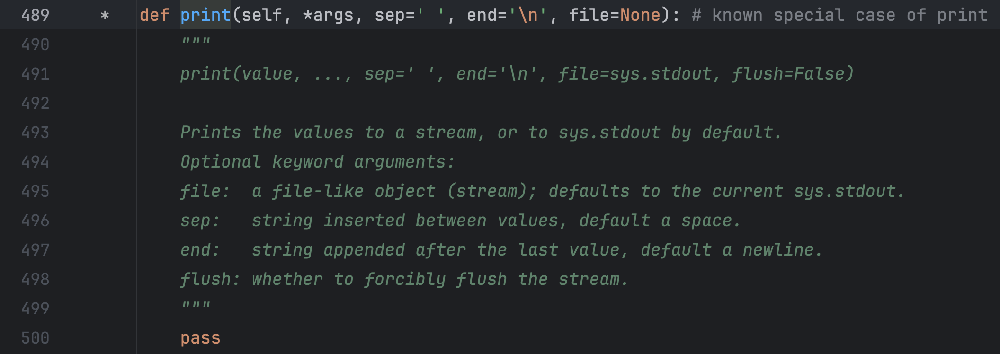

## 1.字符串的定义

字符串是由字母，数字和特殊字符组成的特殊序列


## 2.创建字符串

 **如何创建字符串？**

——使用单引号，双引号或者三引号

```python
name = ‘Cindy’
number = “31”
paragraph = '''Hello everyone!
hello Cindy!'''
```

**为什么python同时支持三种创建字符串的方法**

双引号和单引号在一起可以避免歧义

可以双引号中需要引号的部分使用单引号

三个引号可以分行，不用重复打引号

但是英文当中可以缩写如下：

```python
string = 'I'm bornforthis.'  # 在英文当中也可以这样缩写
print(string)


# 输出
  File "/Users/huangjiabao/GitHub/iMac/Pycharm/StudentCoder/39-YDN/lesson2.py", line 15
    string = 'I'm bornforthis.'  # 在英文当中也可以这样缩写
                ^
SyntaxError: invalid syntax
```

**因为，开头是单引号，所以 Python 会寻找到下一个第一次出现的单引号进行匹配。而第一个单引号不在字符串的末尾，所以导致整个字符串异常。（没有完全包裹字符串全部内容）**

如何解决上面描述的问题呢？——使用双引号。

```python
string = "I'm bornforthis."  # 外面使用双引号进行包裹即可
print(string)

# 输出
I'm bornforthis.
```

- 有时候我们需要字符串里面有单引号或双引号，此时发挥作用： **<span style="color:orange">单双引号混用，是第一个原因</span>**

那么三引号呢？

假设我们现在需要存储如下文本：

```python
我们有时候不仅仅要看选择项以内的答案，也要去思考选择项以外的答案。——AI悦创

浅者见浅，深者见深——黄家宝

起的最早的是理想主义者，跑的最快的是骗子，而胆子最大的是那些冒险家，害怕错过一切，疯狂往里冲的是韭菜，而真正的成功者，可能还没有入场。

先实现功能，再去优化，否则一切会很乱。——AI悦创

凡是你不能清晰写下来的东西，都是你还没有真正理解的东西
```

放入字符串，我们如何在 Python 代码实现呢？

```python
string = "我们有时候不仅仅要看选择项以内的答案，也要去思考选择项以外的答案。——AI悦创

浅者见浅，深者见深——黄家宝

起的最早的是理想主义者，跑的最快的是骗子，而胆子最大的是那些冒险家，害怕错过一切，疯狂往里冲的是韭菜，而真正的成功者，可能还没有入场。

先实现功能，再去优化，否则一切会很乱。——AI悦创

凡是你不能清晰写下来的东西，都是你还没有真正理解的东西"  # 外面使用双引号进行包裹即可
print(string)

# 输出
  File "/Users/huangjiabao/GitHub/iMac/Pycharm/StudentCoder/39-YDN/lesson2.py", line 15
    string = "我们有时候不仅仅要看选择项以内的答案，也要去思考选择项以外的答案。——AI悦创
                                                     ^
SyntaxError: EOL while scanning string literal
```

常规的单引号、双引号是不支持多行文本，但是有一个方法可以间接实现看似多行文本，但实际是单行，在每一行的末尾添加  `\`：

```python
string = "我们有时候不仅仅要看选择项以内的答案，也要去思考选择项以外的答案。——AI悦创 \
\
浅者见浅，深者见深——黄家宝\
\
起的最早的是理想主义者，跑的最快的是骗子，而胆子最大的是那些冒险家，害怕错过一切，疯狂往里冲的是韭菜，而真正的成功者，可能还没有入场。\
\
先实现功能，再去优化，否则一切会很乱。——AI悦创\
\
凡是你不能清晰写下来的东西，都是你还没有真正理解的东西"  # 外面使用双引号进行包裹即可
print(string)

# 输出
我们有时候不仅仅要看选择项以内的答案，也要去思考选择项以外的答案。——AI悦创 浅者见浅，深者见深——黄家宝起的最早的是理想主义者，跑的最快的是骗子，而胆子最大的是那些冒险家，害怕错过一切，疯狂往里冲的是韭菜，而真正的成功者，可能还没有入场。先实现功能，再去优化，否则一切会很乱。——AI悦创凡是你不能清晰写下来的东西，都是你还没有真正理解的东西
```

从上面的输出可知，每行结尾添加 `\` 只能实现看起来换行，实际上还是一行。「就是：一行显示不完，换行显示而已，但是本身还是一行」


此时，我们使用三引号测试：

```python
string = """我们有时候不仅仅要看选择项以内的答案，也要去思考选择项以外的答案。——AI悦创 

浅者见浅，深者见深——黄家宝

起的最早的是理想主义者，跑的最快的是骗子，而胆子最大的是那些冒险家，害怕错过一切，疯狂往里冲的是韭菜，而真正的成功者，可能还没有入场。

先实现功能，再去优化，否则一切会很乱。——AI悦创

凡是你不能清晰写下来的东西，都是你还没有真正理解的东西"""  # 外面使用双引号进行包裹即可
print(string)


# 输出
我们有时候不仅仅要看选择项以内的答案，也要去思考选择项以外的答案。——AI悦创 

浅者见浅，深者见深——黄家宝

起的最早的是理想主义者，跑的最快的是骗子，而胆子最大的是那些冒险家，害怕错过一切，疯狂往里冲的是韭菜，而真正的成功者，可能还没有入场。

先实现功能，再去优化，否则一切会很乱。——AI悦创

凡是你不能清晰写下来的东西，都是你还没有真正理解的东西
```

可以从上面的输出可知，原本什么格式，输出就是什么格式。「原样输出」「三个单引号的效果和上面一样」

- **<span style="color:orange">三个单引号或者三个双引号，实现原样输出。</span>**
- **<span style="color:orange">多行注释</span>**
- **<span style="color:orange">单双三引号混用</span>**（代码略）



## 3. 字符串长度

如何获取字符串长度？ —— `len()`

`len():`返回字符串中字符长度或字符数。

```python
paragraph = "Hello everyone!"
print(len(paragraph))
```

在使用len获取字符串长度时，是从数字1开始的。


## 4. 字符串中字符的获取

### 4.1 获取单个字符

```python
string = "bornforthis"
select = string[0]
print(select)
select_1 = string[-1]
select_2 = string[10]
select_3 = len(string)
print(string[select_3 - 1])
#output
b
s
```

### 4.2 获取多个连续字符

```python
string = "bornforthis"
"""
语法：string = "bornforthis"
select = string[start:end]
PS: end 要+1
"""
#获取字符串bor
select = string[0:3]
print(select)
select_1 = string[4:7]
select_2 = string[-4:]
print(select_1)
print(select_2)

#output
bor
for
this
```

### 4.3 获取多个不连续字符 

```
string = "0123456789"
"""
语法：string = "0123456789"
select = string[start: end: sep]
PS: end 要+1
"""
#获取字符串bor
select = string[0: len(string): 2]
print(select)
```

``` python
string = "0123456789"
"""
语法：string = "0123456789"
select = string[start: end: sep]
PS: end 要+1
"""
#获取字符串bor
select = string[0: len(string): 2]
select_1 = string[1: len(string) : 2]
string_1 = "bornforthis"
select_2 = string_1[1: len(string_1): 3]
select_3 = string_1[0: len(string_1): 3]
print(select)
print(select_1)
print(select_2)
print(select_3)

#output
02468
13579
ofts
bnri
```

优化方法，从0开始，默认不需要写，到结尾，也可以不写

所以从开始到结尾，打印步长为2的所有数

```
string = "0123456789"
select = string[:: 2]
print(select)
```

如果不是从[0]开始，就不可以省略

### 4.4 字符串倒序

#### 4.4.1 实现

字符串的第三个位置，控制的是字符的提取方向。默认正数为1，如果改成-1，则会变成反方向。

:::warning

正负控制方向，数字大小控制步长

:::

```python
string = "Vervevividness"
select = string[::-1]
print(select)
#output
ssendivivevreV
```

#### 4.4.2`string[::1]`省略了

```python
string = "Vervevividness"
select = string[0: 15: -1]
print(select)#无结果
```

方向相互冲突，所以没有结果


```python
string = "Vervevividness"
select = string[len(string):0:-1]
print(select)
#output
ssendivivevre
```

0+1 = 1 仍然取不到[0]的数值

可以通过省略0来解决这个问题

#####  4.4.2.1方法

重写开始结尾

```python
string = "Vervevividness"
select = string[-1:-15:-1]
print(select)
#output
ssendivivevreV
```


```python
string = "bornforthis"
#rofn
select = string[-5: -9: -1]
print(select)
#output
rofn
```

## 5. 字符串内置方法

### 5.1 .upper()

将字符串内容，全部转成大写

```python
string = "bornforthis"
upper_string  = string.upper()
print(upper_string)
#output
BORNFORTHIS
```

### 5.2 .lower()

将字符串的内容全部转成小写

```python
string = "BORNFORTHIS"
lower_string  = string.lower()
print(lower_string)
#output
bornforthis
```

### 5.3 .capitalize()

将字符串首字母转换成大写（只有首字母）

```python
string = "hello, I am Lisa"
capitalize_string  = string.capitalize()
print(capitalize_string)
#output
Hello, i am lisa

```

### 5.4 .title()

将字符串的每个单词的首字母大写（无论什么间隔）

```python
string = "hello, I-am-lisa"
title_string  = string.title()
print(title_string)
#output
Hello, I-Am-Lisa
```

### 5.5 .startswith()

```python
string = "hello, I-am-lisa"
new_string  = string.startswith("h")
print(new_string)
new_string1  = string.startswith("he")
print(new_string1)
#output
True
True

```

### 5.6 .endswith()

```python
string = "hello, I-am-lisa"
new_string  = string.endswith("-lisa")
print(new_string)
new_string_1  = string.endswith("s")
print(new_string_1)
#output
True
False
```

### 5.7 .count()

检测目标（特定）字符出现的次数

```python
string = "bornforthis"
new_string  = string.count("r")
print(new_string)
string = "I like apple apple apple apple"
new_string  = string.count("apple")
print(new_string)
#output
2
4
```

### 5.8 .find()

寻找目标字符或单词在特定字符串中，第一次出现的下标。如果是查找单词，那么`find( )` 返回目标单词第一个字母的下标。

如果查询的字符或单词不存在，则返回“-1”

```python
string = "bornforthis"
new_string  = string.find("b")
print(new_string)

#output
0
```

```python
string = "bornforthis"
new_string  = string.find("a")
print(new_string)

#output
-1
```

```python
string = "bornforthis"
new_string  = string.find("orn")
print(new_string)

#output
1
```

### 5.9 .index()

寻找目标字符或单词在特定字符串，第一次出现的下标。如果是查找单词，那么`index（）`返回目标单词的第一个字符的下标

如果查询的单词不存在，则报错

```python
string = "bornforthis"
new_string = string.index("orn")
print(new_string)
#output
1

string = "bornforthis"
new_string_1 = string.index("q")
print(new_string_1)
#output
Traceback (most recent call last):
  File "/Users/wangruoyihan/PycharmProjects/pythonProject/python 11.12.py", line 95, in <module>
    new_string_1 = string.index("q")
                   ^^^^^^^^^^^^^^^^^
ValueError: substring not found
```

### 5.10 .isdigit()

判断字符串是不是纯数字字符串，字符串中只要有一个字符是非数字，则返回false。

```python
string = "12345678"
result = string.isdigit()
print(result)

#output
True

string = "12345678a"
result = string.isdigit()
print(result)
#output
false
```

### 5.11 .isalpha()

判断字符串是不是纯字母字符串，字符串中只要有一个字符是非字母字，则返回false。

```python
string = "Verveviviness"
result = string.isalpha()
print(result)

#output
True

string = "Verve vividness"
result = string.isalpha()
print(result)
#output
false
```

### 5.12 .isalnum()

判断字符串是不是纯数字或者纯字母，纯数字字母字符串，字符串中但凡出现非数字字母元素，则返回False

```python
string = "Verveviviness"
result = string.isalnum()
print(result)

#output
True

string = "123456"
result = string.isalnum()
print(result)
#output
True

string = "Verveviviness1234"
result = string.isalnum()
print(result)

#output
True
```

### 5.13 .isupper

判断字符串是否全部大写，字符串中只要有一个字符是非大写，则返回false。

```python
string = "HELLO"
boolean = string.isupper()
print(boolean)
#output
True

string = "HELLOa"
boolean = string.isupper()
print(boolean)
#output
False

string = "HELLO$$"
boolean = string.isupper()
print(boolean)
#output
True
```

### 5.14 .islower

判断字符串是否全部小写，字符串中只要有一个字符是非小写，则返回false。

```python
string = "hello"
boolean = string.islower()
print(boolean)
#output
True

string = "Helloa"
boolean = string.islower()
print(boolean)
#output
False

string = "hello$$"
boolean = string.islower()
print(boolean)
#output
True
```

### 5.15 .isspace

判断字符串是否为纯空格，多少个空格都可以。纯空格返回True，否则返回False

```python
string = "     "
boolean = string.isspace()
print(boolean)
#output
True

string = " "
boolean = string.isspace()
print(boolean)
#output
True

string = "hello$$"
boolean = string.isspace()
print(boolean)
#output
False
```

### 5.16 .strip()

默认去掉目标字符串的前后空白字符，如果指定参数，则去掉指定字符。

```python
string = "  Vervevividness  "
strip_string = string.strip()
print("原本字符串", string)
print("去掉空白后的", strip_string)
#output
原本字符串   Vervevividness  
去掉空白后的 Vervevividness

string = " --Vervevividness--  "
strip_string = string.strip("- ")# 如果只打-，只会去除连续的减号
print("原本字符串", string)
print("去掉-和空白后的", strip_string) #没有先后顺序
#output
原本字符串  --Vervevividness--  
去掉-和空白后的 Vervevividness
```

### 5.17 .lstrip()

默认去掉字符串左边的空白字符，如果指定参数，则去掉左边的指定字符。

```python
string = "   bornforthis   "
lstrip_string = string.lstrip()
print("原本的字符串:", string)
print("去掉左边空白字符后:", lstrip_string)

# ---output---
原本的字符串:    bornforthis   
去掉左边空白字符后: bornforthis   


string = "----bornforthis----"
lstrip_string = string.lstrip('-')
print("原本的字符串:", string)
print("去掉左边 '-' 后:", lstrip_string)


# ---output---
原本的字符串: ----bornforthis----
去掉左边 '-' 后: bornforthis----

string = "-- --bornforthis----"
lstrip_string = string.lstrip('- ')  # 不分先后顺序
print("原本的字符串:", string)
print("去掉左边 '- ' 后:", lstrip_string)

# ---output---
原本的字符串: -- --bornforthis----
去掉左边 '- ' 后: bornforthis----
```

### 5.18 .Rsrip()

默认去掉字符串右边的空白字符，如果指定参数，则去掉右边的指定字符。

```python
string = "   bornforthis   "
rstrip_string = string.rstrip()
print("原本的字符串:", string)
print("去掉右边空白字符后:", rstrip_string)

# ---output---
原本的字符串:    bornforthis   
去掉右边空白字符后:    bornforthis


string = "----bornforthis----"
rstrip_string = string.rstrip('-')
print("原本的字符串:", string)
print("去掉右边 '-' 后:", rstrip_string)

# ---output---
原本的字符串: ----bornforthis----
去掉右边 '-' 后: ----bornforthis


string = "----bornforthis-- --"
rstrip_string = string.rstrip('- ')  # 不分先后顺序
print("原本的字符串:", string)
print("去掉右边 '- ' 后:", rstrip_string)

# ---output---
原本的字符串: ----bornforthis-- --
去掉右边 '- ' 后: ----bornforthis
```

### 5.19 .replce()

```python
string = "  Vervevividness  "
replace_string = string.replace(' ', '@', 1)
print("原本的： ", string)
print("改后的： ", replace_string)
#output
原本的：    Vervevividness  
改后的：  @ Vervevividness  

string = "  Vervevividness  "
replace_string = string.replace(' ', '@',)
print("原本的： ", string)
print("改后的： ", replace_string)
#output
原本的：    Vervevividness  
改后的：  @@Vervevividness@@

string = "  11--Vervevividness--11  "
replace_string = string.replace('1-', 'ai-',)
print("原本的： ", string)
print("改后的： ", replace_string)
#output
原本的：    11--Vervevividness--11  
改后的：    1ai--Vervevividness--11  

```

### 5.20 .split()

`.split(sep, maxsplit)`以特定字符进行分割，默认空格分割。如果传入参数「sep」，则以参数进行分割。返回分割后的列表。maxsplit用于控制分割几次。

```python
string = "hello bornforthis ok"
string_split = string.split()
print("原本的字符串: ", string)
print("分割后的: ", string_split)

string = "hello-bornforthis-ok"
string_split = string.split('-')
print("原本的字符串: ", string)
print("分割后的: ", string_split)

string = "hello-bornforthis-ok"
string_split = string.split(sep='-', maxsplit=1)
print("原本的字符串: ", string)
print("分割后的: ", string_split)

#output
原本的字符串:  hello bornforthis ok
分割后的:  ['hello', 'bornforthis', 'ok']
原本的字符串:  hello-bornforthis-ok
分割后的:  ['hello', 'bornforthis', 'ok']
原本的字符串:  hello-bornforthis-ok
分割后的:  ['hello', 'bornforthis-ok']
```

### 5.21 rsplit

`.rsplit(sep, maxsplit)` 从字符串右边进行分割，也可以传入参数「sep」，进行指定分割。返回分割后的列表。maxsplit 指定分割次数。

```python
string = "hello bornforthis ok"
string_split = string.rsplit()
print("原本的字符串: ", string)
print("分割后的: ", string_split)

string = "hello-bornforthis-ok"
string_split = string.rsplit('-')
print("原本的字符串: ", string)
print("分割后的: ", string_split)

string = "hello-bornforthis-ok"
string_split = string.rsplit('-', 1)
print("原本的字符串: ", string)
print("分割后的: ", string_split)

#output
原本的字符串:  hello bornforthis ok
分割后的:  ['hello', 'bornforthis', 'ok']
原本的字符串:  hello-bornforthis-ok
分割后的:  ['hello', 'bornforthis', 'ok']
原本的字符串:  hello-bornforthis-ok
分割后的:  ['hello-bornforthis', 'ok']
```

### 5.22 join()

以特定字符使字符串间隔。

```python
string = "Vervevividness"
join_string = '-'.join(string)
print("原本的字符串:" ,string)
print("添加之后的:", join_string)
#output
原本的字符串: Vervevividness
添加之后的: V-e-r-v-e-v-i-v-i-d-n-e-s-s
```

## 6. 字符串格式化

```python
string = 'Hi bornforthis, welcome to here'
print(string)
```

- 所存在的问题：需要换一个人名或者地区，就需要重新创建一个全新的字符串。
- 我们更希望有类似模版，让我们不同的人名、地面填写进去。而不是每个人都从头创建一个新字符串。

当然，这个时候有可能会想到使用字符串的加法，但字符串加法存在问题。

```python
str1 = "Hi "
str2 = "welcome to here"
n = str1 + "Cindy, " + str2
print(n)
#output

Hi Cindy, welcome to here
```

由上面的代码可知，虽然实现了。但是很繁琐，如果更复杂的字符就不合适了。

另一个问题是，在python中不同的数据类型不能直接相加，除非强制转化为字符串：

```python
string = "Money is: " + 190
print(string)
#output
Traceback (most recent call last):
  File "/Users/wangruoyihan/PycharmProjects/pythonProject/python 11.12.py", line 98, in <module>
    string = "Money is: " + 190
             ~~~~~~~~~~~~~^~~~~
TypeError: can only concatenate str (not "int") to str

string = "Money is: " +str(190)
print(string)
```

—format就应运而生了

### 6.1 format()

1. 单个花括号

```python
string = "Hello {}, Welcome to Vervevividness.".format("Sam")
print(string)

template_string = "Hi {}, Welcome to Vervevividness"
print(template_string.format("Cindy"))

new_string = template_string.format("guys")
print(new_string)

#output
Hello Sam, Welcome to Vervevividness.
Hi Cindy, Welcome to Vervevividness
Hi guys, Welcome to Vervevividness
```

2. 多个花括号，按照顺序填充

```python
string = "Hello {}, Welcome to {}.".format("Sam", "Vervevividness")
print(string)

template_string = "Hi {}, Welcome to {}"
print(template_string.format("Cindy", "Shanghai"))

new_string = template_string.format("guys", "here")
print(new_string)

#output
Hello Sam, Welcome to Vervevividness.
Hi Cindy, Welcome to Shanghai
Hi guys, Welcome to here
```

3. 多个花括号指定位置

```python
string = "Hello {1}, Welcome to {0}.".format("Vervevividness", "Sam")
print(string)

template_string = "Hi {1}, Welcome to {0}"
print(template_string.format("Shanghai", "Cindy"))

new_string = template_string.format("here", "guys")
print(new_string)

#output
Hello Sam, Welcome to Vervevividness.
Hi Cindy, Welcome to Shanghai
Hi guys, Welcome to here
```

4. 参数指定

```python
string = "Hello {name}, Welcome to {region}.".format(name = "Sam", region = "Vervevividness")
print(string)

template_string = "Hi {name}, Welcome to {region}"
print(template_string.format(name = "Cindy", region = "Shanghai"))

new_string = template_string.format(name = "guys", region = "here")
print(new_string)

#output
Hello Sam, Welcome to Vervevividness.
Hi Cindy, Welcome to Shanghai
Hi guys, Welcome to here
```

5. 保留指定小数位

```python
string = "Money is {:.3f}.".format(190)
print(string)

#output
Money is 190.000.
```

### 6.2 f

1. 直接读取变量

```python
name = "Cindy"
region = "Vervevividness"
string = f"Hi {name}, welcome to {region}."
print(string)

#output
Hi Cindy, welcome to Vervevividness.
```

2. 保留小数位

```python
money = 200
string = f"Money is {money:.3f}."
print(string)

#output
Money is 200.000.
```

### %6.3 格式化

- `%d`:整数
- `%s:`字符串
- `%f:`浮点数

1. 单个位置传入

```python
string = "Money is %d"
new_s = string % 13
print(new_s)
print(string % 19)
string = "Money is %d" %19
print(string)

#output
Money is 13
Money is 19
Money is 19
```

2. 多个位置传入

```python
string = "Money is %d %s"
new_s = string % (13, "hello")
print(new_s)
print(string % (19, "HI"))
string = "Money is %d %s" %(19, "haha")
print(string)

#output
Money is 13 hello
Money is 19 HI
Money is 19 haha
```

```python
string = "Money is %d %s"
new_s = string % (13, 'make a million')
print(new_s)
print(string % (888, 'sudden wealth'))
string = "Money is %d %s" % (190, 'super rich')
print(string)

# ---output---
Money is 13 make a million
Money is 888 sudden wealth
Money is 190 super rich
```

3. 保留小数位

```python
string = "Money is %.3f"
new_s = string % 19
print(new_s)
print(string % 18)
string = "Money is %.3f" % 180
print(string)


# ---output---
Money is 19.000
Money is 18.000
Money is 180.000
```

### 6.4 f 和 format的优缺点

format 和 % 都像模版，提前做好模版后面有需要试可以直接使用；

而 f 就像在银行当中，柜员边问你边登记，不能提前做好模版。

## 7. 字符串的不可变性

字符串是不可变的，不可以改变字符串中的任何元素，如需改变字符串中的元素，则需要新建一个字符串。

```python
s = "Verevevividness"
s[0] = "c"
#output
Traceback (most recent call last):
  File "/Users/wangruoyihan/PycharmProjects/pythonProject/python 11.12.py", line 98, in <module>
    s[0] = "c"
    ~^^^
TypeError: 'str' object does not support item assignment
```

除了使用replace还可以使用字符串拼接：

```python
s = "vervevividness"
new = "a"+ s[1:]
print(new)

#output
aervevividness
```

## 8. 字符串转义

| 转义字符 | 含义                               | 例子                    |
| -------- | ---------------------------------- | ----------------------- |
| `\\`     | 反斜杠符号，为了在字符串中得到 `\` | `s = "bor\\nforthis"`   |
| `\b`     | 退格，类似删除键                   | `s = "bornff\borthis"`  |
| `\n`     | 换行                               | `s = "bornfor\nthis"`   |
| `\t`     | 制表符                             | `s = "born\tfor\tthis"` |
| `r`      | 取消转义「R和r」都可以             | `s = r"born\nforthis`   |

示例代码：

```python
s = "Vervevividness"
print(s)

s= "Verve\nvividness"
print(s)

s= r"Verve\nvividness"
print(s)

s = "Verve\bvividness"
print(s)

s = "Verve\\nvividness"
print(s)

s = "a\tb\tc\td"
print(s)

#output
Vervevividness
Verve
vividness
Verve\nvividness
Vervvividness
Verve\nvividness
a	b	c	d
```

## 9. 字符串的连接

```python
s1 = "Verve"
s2 = "vividness"
print(s1 +s2)
print(s1, s2)

#output
Vervevividness
Verve vividness

s1 = '*-love-'
print(s1 *10)
*-love-*-love-*-love-*-love-*-love-*-love-*-love-*-love-*-love-*-love-
```

在末尾输出一个*

```python
s1 = '*-love-'
print(s1 * 10 + s1[0])
print(s1 * 10, end = '*')

```

## 10. 读取用户输入

### 10.1 input()基本使用

使用`input`获取用户输入

```python
user_input = input("please input your information: ")
print(user_input)
#output
please input your indormation: hello
hello
```

```python
In [5]: type(input(':>>>'))
:>>>(1, 2, 3, 4)
Out[5]: str

In [6]: type(input(':>>>'))
:>>>"hello"   
Out[6]: str

In [7]: type(input(':>>>'))
:>>>{ 'a' : 10, 'b' : 20 }
Out[7]: str

In [8]: type(input(':>>>'))
:>>>True
Out[8]: str

```

通过上面的代码示例，我们可以知道：通过 `input()` 获取用户输入，得到的数据类型都是**字符串**。

得知 `input()` 的特点后，如何解决这个问题呢？——用户如何实现：直接输入原有的类型并得到原有的类型。

```python
In [9]: n = int(input(':>>>'))
:>>>12

In [10]: typr(n)

In [11]: type(n)
Out[11]: int

In [12]: #存在一些问题

In [13]: s = list(input('>>>'))
>>>[1, 2, 3, 4]

In [14]: print(s)
['[', '1', ',', ' ', '2', ',', ' ', '3', ',', ' ', '4', ']']

```

- 适合：数字「整数，浮点数」，字符串，布尔形
- 不适合：列表，元组，字典，集合

### 10.3.3 

```python
In [15]: s = eval(input('>>>'))
>>>12

In [16]: type(s),s
Out[16]: (int, 12)

In [17]: s = eval(input('>>>'))
>>>[1, 2, 3]

In [18]: type(s),s
Out[18]: (list, [1, 2, 3])

In [19]: s = eval(input('>>>'))
>>>{1, 2, 3}

In [20]: type
Out[20]: type

In [21]: type(s),s
Out[21]: (set, {1, 2, 3})

In [23]: s = eval(input('>>>'))
>>>{'a': 10, 'b' : 12}

In [24]: type(s),s
Out[24]: (dict, {'a': 10, 'b': 12})

```

2. `eval()`伴随的问题

```python
In [25]: s = eval(input('>>>'))
>>>string
---------------------------------------------------------------------------
NameError                                 Traceback (most recent call last)
Cell In[25], line 1
----> 1 s = eval(input('>>>'))

File <string>:1

NameError: name 'string' is not defined

```

稍微分析一下 `eval()` 的功能“大概”实现原因：

- input 获取用户输入，得到字符串类型。

```python
In [44]: s = input(':>>>')
:>>>[1, 2, 3]

In [45]: s
Out[45]: '[1, 2, 3]'
```

从上面的代码可以得知，eval 大概率实现的是去掉字符串左右两边的引号。「这个地方 eval 或许不是按我说的实现，但是为了让你们更好理解原理，先这样来。」

所以，为什么会导致上面的报错呢？

1. 获取用户输入：`s = eval(input(":>>>"))`
2. 其中input会得到`‘string’`,而通过`eval`转换之后，就类似于`string`变量。但是在之前的代码中，并没有创建string这个变量。
3. 解决方法：
    1. 在获取用户输入之前提前创建一个叫做string的变量；「但不是我们想要的」
    2. 输入时，有意加上单引号或双引号

```python
In [50]: string = 'hello this string'

In [51]: s = eval(input(':>>>'))
:>>>string

In [52]: s
Out[52]: 'hello this string'

In [53]: num = 12

In [54]: s = eval(input(':>>>'))
:>>>num

In [55]: type(s), s
Out[55]: (int, 12)

In [56]: s = eval(input(':>>>'))
:>>>'string'

In [57]: type(s), s
Out[57]: (str, 'string')
```

3. `eval()`小技巧

```python
In [27]: eval(input('>>>'))
>>>1 + 1
Out[27]: 2

In [28]: eval(input('>>>'))
>>>2 - 1
Out[28]: 1

In [29]: eval(input('>>>'))
>>>9 * 8
Out[29]: 72

In [30]: eval(input('>>>'))
>>>9 / 3
Out[30]: 3.0

```

