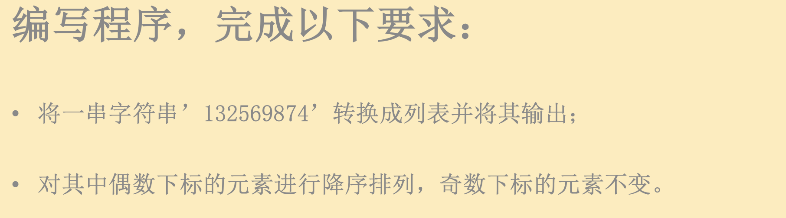

```python
numbers = list('132569874')
numbers_even_position = numbers[::2]
numbers_even_position.sort(reverse=True)
numbers[::2] = numbers_even_position
print(numbers)

#output
['8', '3', '6', '5', '4', '9', '2', '7', '1']
```


