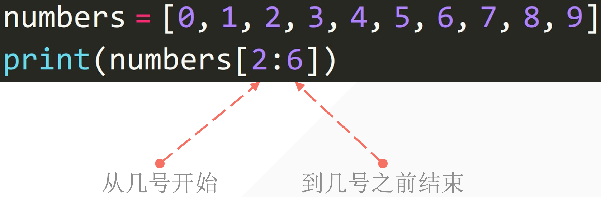
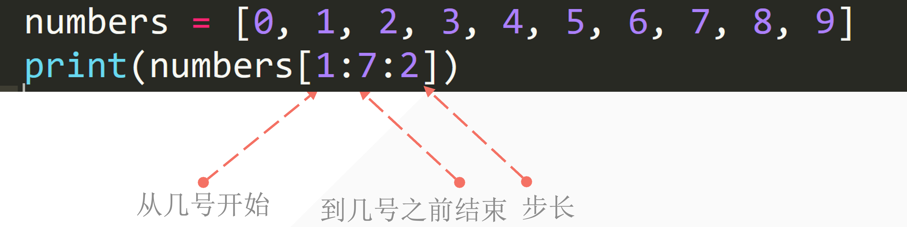
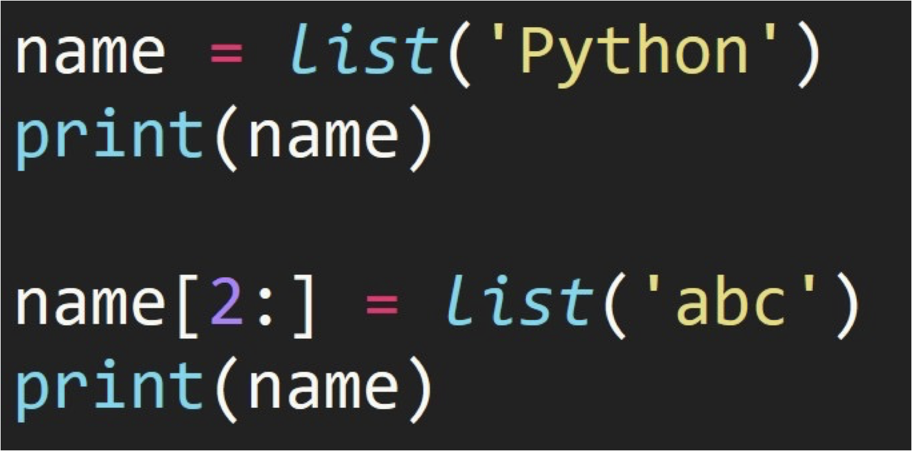
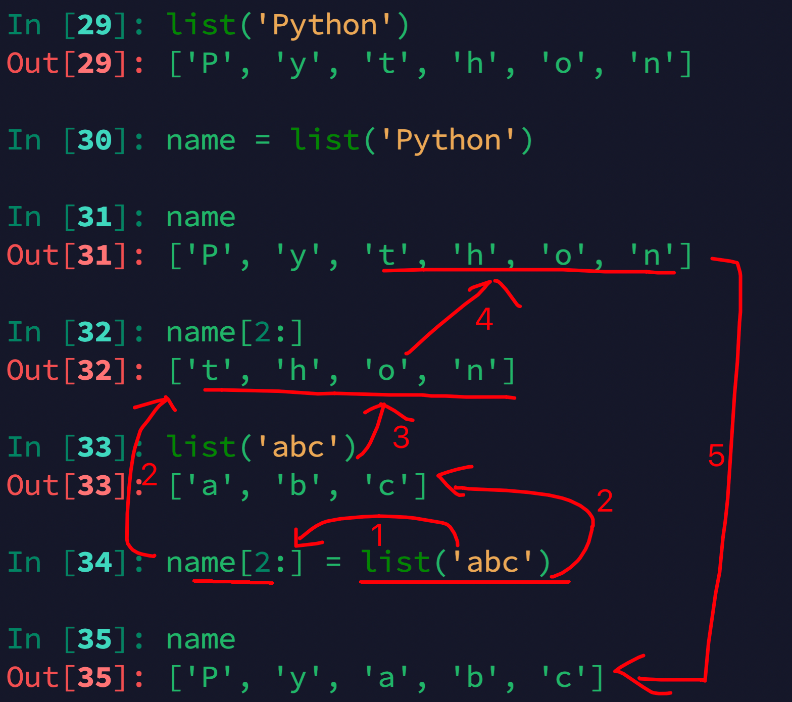
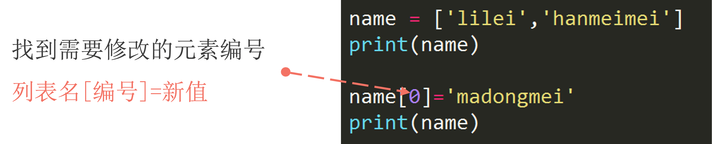
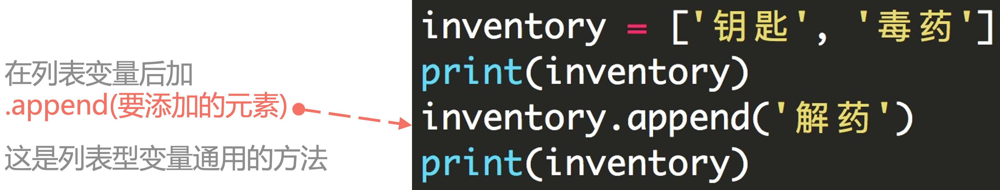
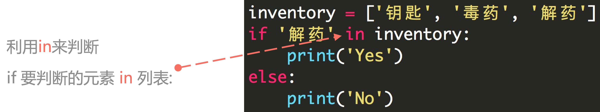

## 1. 列表结构

- 利用中括号表示列表
- 列表内元素用逗号隔开
- 注意是英文输入法下的逗号

```python
student1 = ['lilei', 18, 'class01', 201901]
student2 = ['hanmeimei', 19, 'class02', 201902]
```

列表的可变性：可以修改列表里面的内容。

```python
list ("Hello")
print(list)

#output
['H', 'e', 'l', 'l', 'o']
```

- 字符串强制转换成列表

## 2. 获取列表的某个元素

### 2.1 列表下标的组成

编程语言中通常第一个位置的编号是0


### 2.2 提取单个元素

```python
grade = [ 97, 98, 99, 100]
print(grade[0])
print(grade[0] +grade[3])
```

### 2.3 获取列表中连续几个元素

- 中括号内用 **<span style="color:orange">起始位置:结束位置</span>** 描述

- 注意：不包括结束位置的那个元素

```python
numbers = [1, 2, 3, 4, 5, 6, 7, 8, 9, 10]
print(numbers[2:6])
#[3, 4, 5, 6]
```



### 2.4 获取列表中连续且特定间隔的元素

- 更细致的用法**<span style="color:orange">起始位置:结束位置:步长</span>**

- **注意**： 不包括结束位置的元素

```python
numbers = [1, 2, 3, 4, 5, 6, 7, 8, 9, 10]
print(numbers[1:7:2])
#[2, 4, 6]
```




## 3. 列表的切片赋值

::: tabs

@tab Code



```python
In [1]: list('python')
Out[1]: ['p', 'y', 't', 'h', 'o', 'n']

In [2]: name = list('python')

In [3]: name
Out[3]: ['p', 'y', 't', 'h', 'o', 'n']

In [4]: name[2:]
Out[4]: ['t', 'h', 'o', 'n']

In [5]: list('abc')
Out[5]: ['a', 'b', 'c']

In [6]: name[2:] = list('abc')

In [7]: name
Out[7]: ['p', 'y', 'a', 'b', 'c']

```

@tab Thinking



:::

```python
In [18]: numbers = [1,5]

In [19]: numbers[1:1]
Out[19]: []

In [20]: numbers[1:1]=[2,3,4]

In [21]: numbers
Out[21]: [1, 2, 3, 4, 5]

In [22]: numbers[1:4]
Out[22]: [2, 3, 4]

In [24]: numbers[1:4]=[]

In [25]: numbers
Out[25]: [1, 5]

```

## 4. 小试牛🔪

获取用户输入两个值，一个是要插入的位置，一个是要插入这个位置的值。

给定下面列表：

```python
numbers = [1, 2, 3, 5, 6]
```

```python
numbers = [1, 2, 3, 5, 6] #given list
get_position = int(input("please enter the position that you want to insert the value: "))
get_number = int(input("please enter the number that you want to insert: "))
numbers[get_position:get_position] = [get_number]
print(numbers)

#please enter the position that you want to insert the value: 3
please enter the number that you want to insert: 2
[1, 2, 3, 2, 5, 6]
```

## 5. 在列表的特定位置插入元素「.insert()」

`.insert(index, element)` 是一个列表的基本方法，用于在列表的指定位置插入一个元素。

它的基本语法是：

```python
list.insert(index, element)
```

- `index`: 指定要插入元素的位置。索引从 0 开始。如果指定的索引超出了列表的当前长度「不会报错」，则元素将被添加到列表的末尾。
- `element`: 这是你想要插入列表的元素。

它的基本语法是

```python'
list.insert(index, object)
```


```python
numbers = [1, 2, 3, 5, 6]
numbers.insert(3, 4)
print(numbers)
#[1, 2, 3, 4, 5, 6]

```


##  6. 列表长度

获取列表长度，使用`len()`:

```python
grade = [98, 99, 95, 80]
print(len(grade))

#output
4
```


## 7. 修改列表中的元素



1. 单个元素修改

```python
grade = [98, 99, 100]
print("before editing: ", grade)

grade[0] = 97
print("after editing: ", grade)
#output
before editing:  [98, 99, 100]
after editing:  [97, 99, 100]
```

2. 多个元素修改

```python
numbers = [1, 2, 3, 4, 5, 6, 7, 8, 8, 10]
print("before editing: ", numbers)

numbers[1:5] = ["1", "2", "3", "4", "5"]
print("after editing: ", numbers)

#output
before editing:  [1, 2, 3, 4, 5, 6, 7, 8, 8, 10]
after editing:  [1, '1', '2', '3', '4', '5', 6, 7, 8, 8, 10]
```

```python
numbers = [1, 2, 3, 4, 5, 6, 7, 8, 9, 10]
print("before editing: ", numbers)

numbers[1:5] = ["1", "2"]
print("after editing: ", numbers)

#output
before editing:  [1, 2, 3, 4, 5, 6, 7, 9, 8, 10]
after editing:  [1, '1', '2', 6, 7, 8, 9, 10]

```

3. 多个修改的对象也可以是字符串

```python
numbers = [1, 2, 3, 4, 5, 6, 7, 8, 9, 10]
print("before editing: ", numbers)

numbers[1:5] = "NICE TO MEET YOU"
print("after editing: ", numbers)

#output
before editing:  [1, 2, 3, 4, 5, 6, 7, 8, 9, 10]
after editing:  [1, 'N', 'I', 'C', 'E', ' ', 'T', 'O', ' ', 'M', 'E', 'E', 'T', ' ', 'Y', 'O', 'U', 6, 7, 8, 8, 10]

```

- 多个元素修改情况下，可以使用的对象：

    - 列表

    - 元组

    - 集合

    - 字符串

    - 字典「放进去的是 key」

    ```python
    numbers = [1, 2, 3, 4, 5, 6, 7, 8, 9, 10]
    print("before editing: ", numbers)
    
    numbers[1:5] = {'a':1, 'b':2}
    print("after editing: ", numbers)
    
    #output
    before editing:  [1, 2, 3, 4, 5, 6, 7, 8, 9, 10]
    after editing:  [1, 'a', 'b', 6, 7, 8, 9, 10]
    ```

- 多个元素修改的情况下，不可以的对象：

    - 布尔型

    ```python
    numbers = [1, 2, 3, 4, 5, 6, 7, 8, 9, 10]
    print("before editing: ", numbers)
    
    numbers[1:5] = True
    print("after editing: ", numbers)
    
    #output
    before editing:  [1, 2, 3, 4, 5, 6, 7, 8, 9, 10]
    Traceback (most recent call last):
      File "/Users/wangruoyihan/PycharmProjects/pythonProject/python homework.py", line 103, in <module>
        numbers[1:5] = True
        ~~~~~~~^^^^^
    TypeError: can only assign an iterable
    ```

    

## 8. 向列表中添加元素

### 8.1 添加单个元素「.append( )」



```python
lst = [1, 2]
print("before:", lst)

lst.append(3)
print("after: ", lst)

#output
before: [1, 2]
after:  [1, 2, 3]

numbers = [1, 2, 3]
numbers.append([1, 2])
print(numbers)

#output
[1, 2, 3, [1, 2]]
```

### 8.2 添加多个元素「`.extend()`」

```python
numbers = [1, 2, 3]
numbers.extend([1, 2]) #也可以使用tuple
print(numbers)

#output
[1, 2, 3, 1, 2]
```

## 9. 删除列表中的元素

### 9.1 del

del需要指定列表中要删除的单个元素或者多个元素。

```python
numbers = [1, 2, 3, 4]
del numbers[0]
print(numbers)

#output
[2, 3, 4]
```

如果不指定删除的元素，则删除整个变量。

```python
numbers = [1, 2, 3, 4]
del numbers[]
print(numbers)

#output
Traceback (most recent call last):
  File "/Users/wangruoyihan/PycharmProjects/pythonProject/python homework.py", line 102, in <module>
    print(numbers)
          ^^^^^^^
NameError: name 'numbers' is not defined
```

### 9.2 pop( )

`pop()`函数默认删除列表中的最后一个元素，也可以传参数指定要删除的元素下标

```python
numbers = [1, 2, 3]
numbers.pop()
print(numbers)

numbers.pop(0)
print(numbers)

#output
[1, 2]
[2]
```

### 9.3 remove( )

`remove()`指定删除列表中某个元素，例如：`remove('hello')`则指定删除列表中的`‘hello’`元素

```python
numbers = [1, 2, 3, 4]
numbers.remove(1)
print(numbers)

#output
[2, 3, 4]
```


## 10.两个列表相加

直接使用加号就可以

```python
numbers1 = [1, 2, 3]
numbers2 = [4, 5, 6]
print(numbers1 + numbers2)

#output
[1, 2, 3, 4, 5, 6]
```


## 11. 判断某个元素是否存在于列表里面「Value in Sequence」



::: code-tabs

@tab Code1

```python
numbers = [1, 2, 3, 4]
print(5 in numbers)
print(1 in numbers)

#output
False
True
```

@tab Code2

```python
inventory = ['钥匙', '毒药', '解药']
print('解药' in inventory)
print('迷药' in inventory)

# ---output---
True
False
```

:::

## 12. 获取列表中某个元素的重复次数「.count()」

```python
numbers = [1, 2, 3, 4, 2, 5, 7, 1, 3, 2]
print(numbers.count(2))

#output
3
```


## 13. 获取列表中某个元素第一次出现的位置「.index()」

- 用 **<span style="color:orange">列表.index(元素)</span>** 来获取

```python
numbers = [1, 2, 3]
print(numbers.index(1)) #output 0
```


## 14. 列表排序

### 14.1 sort (reverse = False)

`list.sort()`使列表内的元素从小到大排序，直接修改列表本身。如果里面指定`reverse = True`则列表降序排列

```python
numbers = [2, 3, 4, 1, 6, 4, 8, 9]
numbers.sort()
print(numbers) 
#[1, 2, 3, 4, 4, 6, 8, 9]
numbers = [2, 3, 4, 1, 6, 4, 8, 9]
numbers.sort(reverse=True)
print(numbers) 
```


