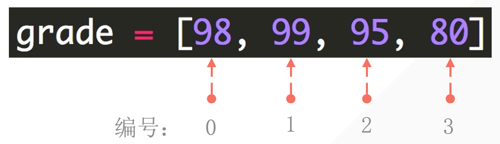

## 1. 列表结构

- 利用中括号表示列表
- 列表内元素用逗号隔开
- 注意是英文输入法下的逗号

```python
student1 = ['lilei', 18, 'class01', 201901]
student2 = ['hanmeimei', 19, 'class02', 201902]
```

列表的可变性：可以修改列表里面的内容。

```python
list ("Hello")
print(list)

#output
['H', 'e', 'l', 'l', 'o']
```

- 字符串强制转换成列表

## 2. 获取列表的某个元素

### 2.1 列表下标的组成

编程语言中通常第一个位置的编号是0



### 2.2 提取单个元素

```python
grade = [ 97, 98, 99, 100]
print(grade[0])
print(grade[0] +grade[3])
```

### 2.3 获取列表中连续几个元素

- 中括号内用 **<span style="color:orange">起始位置:结束位置</span>** 描述

- 注意：不包括结束位置的那个元素

```python
numbers = [1, 2, 3, 4, 5, 6, 7, 8, 9, 10]
print(numbers[2:6])
#[3, 4, 5, 6]
```


### 2.4 获取列表中连续且特定间隔的元素

- 更细致的用法**<span style="color:orange">起始位置:结束位置:步长</span>**

- **注意**： 不包括结束位置的元素

```python
numbers = [1, 2, 3, 4, 5, 6, 7, 8, 9, 10]
print(numbers[1:7:2])
#[2, 4, 6]
```


## 3. 列表的切片赋值

::: tabs

@tab Code


```python
In [1]: list('python')
Out[1]: ['p', 'y', 't', 'h', 'o', 'n']

In [2]: name = list('python')

In [3]: name
Out[3]: ['p', 'y', 't', 'h', 'o', 'n']

In [4]: name[2:]
Out[4]: ['t', 'h', 'o', 'n']

In [5]: list('abc')
Out[5]: ['a', 'b', 'c']

In [6]: name[2:] = list('abc')

In [7]: name
Out[7]: ['p', 'y', 'a', 'b', 'c']

```

@tab Thinking


:::

```python
In [18]: numbers = [1,5]

In [19]: numbers[1:1]
Out[19]: []

In [20]: numbers[1:1]=[2,3,4]

In [21]: numbers
Out[21]: [1, 2, 3, 4, 5]

In [22]: numbers[1:4]
Out[22]: [2, 3, 4]

In [24]: numbers[1:4]=[]

In [25]: numbers
Out[25]: [1, 5]

```

## 4. 小试牛🔪

获取用户输入两个值，一个是要插入的位置，一个是要插入这个位置的值。

给定下面列表：

```python
numbers = [1, 2, 3, 5, 6]
```

```python
numbers = [1, 2, 3, 5, 6] #given list
get_position = int(input("please enter the position that you want to insert the value: "))
get_number = int(input("please enter the number that you want to insert: "))
numbers[get_position:get_position] = [get_number]
print(numbers)

#please enter the position that you want to insert the value: 3
please enter the number that you want to insert: 2
[1, 2, 3, 2, 5, 6]
```

## 5. 在列表的特定位置插入元素「.insert()」

`.insert(index, element)` 是一个列表的基本方法，用于在列表的指定位置插入一个元素。

它的基本语法是：

```python
list.insert(index, element)
```

- `index`: 指定要插入元素的位置。索引从 0 开始。如果指定的索引超出了列表的当前长度「不会报错」，则元素将被添加到列表的末尾。
- `element`: 这是你想要插入列表的元素。

它的基本语法是

```
list.insert(index, object)
```


```
numbers = [1, 2, 3, 5, 6]
numbers.insert(3, 4)
print(numbers)
#[1, 2, 3, 4, 5, 6]

```


##  6. 列表长度


```python
grade = [98, 99, 95, 80]
print(grade[1:: 2])
#output
[98, 95]
grade = [98, 99, 95, 80]
print(grade[:: -1])
#output
[80,95,99,98]
```


