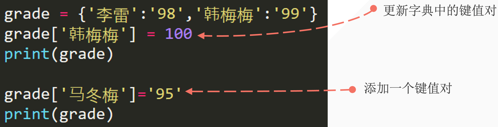
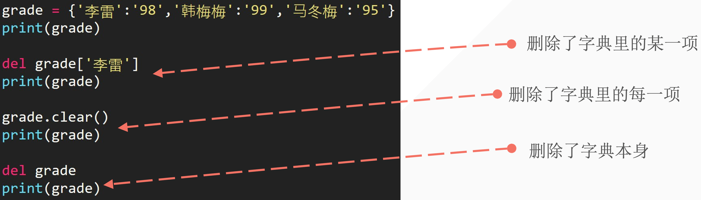

## 1. 如何创建一个电话薄

我们现在有下面的联系人：

| 姓名        | 手机号 |
| ----------- | ------ |
| 李雷        | 123456 |
| 韩梅梅      | 132456 |
| 大卫        | 154389 |
| Mr.Liu      | 131452 |
| Bornforthis | 180595 |
| Alexa       | 131559 |

如何用以往学过的知识构建一个具有用户输入查询功能的电话簿。

> 变量、数字型、列表、元组、字符串。

程序运行效果：

- 测试一：

```python
Enter your search name: 李雷
The 李雷 phone number is: 123456
```

- 测试二：

```python
Enter your search name: Bornforthis
The Bornforthis phone number is: 180595
```

::: code-tabs	

@tab Code1

```python
name = input("Please enter your name: ")
lst_1 = ['李雷', '韩梅梅', '大卫', 'Mr.Liu', 'Bornforthis', 'Alexa']
lst_2 = [123456, 132456, 154389, 131452, 180595, 131559]
new_lst = list(zip(lst_1, lst_2))
position_name = lst_1.index(name)
print(f"The {name} phone number is: {new_lst[position_name][1]}")
```

@tab Code2

```python
name = input("Please enter your name: ")
lst_1 = ['李雷', '韩梅梅', '大卫', 'Mr.Liu', 'Bornforthis', 'Alexa']
lst_2 = [123456, 132456, 154389, 131452, 180595, 131559]
position = lst_1.index(name)
print(f"The {name} phone number is: {lst_2[position]}")
```

@tab Code3

```python
name = input("Please enter your name: ")
lst_1 = ['李雷', 123456, '韩梅梅', 132456, '大卫', 154389,  'Mr.Liu', 131452, 'Bornforthis', 180595,'Alexa', 131559]
position = int(lst_1.index(name))
print(f"The {name} phone number is: {lst_1[position + 1]}")
```

:::

由上面的问题应该要了解两个点：

1. 如何用已有的知识去完成未知的新任务，毕竟不可能包含全部各种需求所需要的数据类型类型；
2. 字典存在意义，从上面题目完成后应该要 get 到。


## 2. 字典结构

- 用 **<span style="color:orange">花括号</span>** 表示字典
- 字典内每一项都有两个元素组成：**<span style="color:orange">key 和 value</span>**
    - `{key: value, key: value}`
- 各个项用 **<span style="color:orange">逗号</span>** 隔开

```python
phone_numbers = {'李雷': '1234','韩梅梅': '3456'}
print(phone_numbers['李雷'])

#1234
```


## 3. 字典结构 key&Value

- key 和 value 是一一对应，同一个键只能有一个对应的值
- 键的类型是不可变的；
- value 的类型是任意的；

```python
names = {'name': '李雷', 'numbers': '1234', 'name': '韩梅梅', True: 'bool', 2: 'int'}
print(names)
#{'name': '韩梅梅', 'numbers': '1234', True: 'bool', 2: 'int'}
```

- 如果用key做列表则报错

```python
names = {['name']: '李雷', 'numbers': '1234'}
print(names)
#---output---
Traceback (most recent call last):
  File "/Users/wangruoyihan/PycharmProjects/pythonProject/python homework.py", line 100, in <module>
    names = {['name']: '李雷', 'numbers': '1234'}
            ^^^^^^^^^^^^^^^^^^^^^^^^^^^^^^^^^^^
TypeError: unhashable type: 'list'
```


## 4. 用字典函数创建字典

- 方法一：根据其他序列新建字典

```python
message = [('lilei' , 98), ('hanmeimei', 99)]
list_to_dict = dict(message)
print(list_to_dict)

#output
{'lilei': 98, 'hanmeimei': 99}
```

- 方法二：根据关键字参数新建字典

```python
d = dict(lilei = 98, hanmeimei = 99)
print(d)
#output
{'lilei': 98, 'hanmeimei': 99}
```

::: info 上面两种创建字典的方法，有什么优缺点？

上面方法一的方法，可以更好的适配字典的各种数据类型情况。why？——因为结构是列表里面放元组，而元组的 0 号位放 key，1 号位放 value。所以，只要是不可变的数据类型都可以放在 0 号位。

反之对比上面方法二：第一个位置必须是“变量”，不能是其它数据类型。举个例子：

```python
d = dict(lilei=98, hanmeimei=99)  # 看起来正常
d = dict('lilei'=98, 'hanmeimei'=99)  # 看起来怎么样？
```

上面第二行代码，看起来就很奇怪了，一共有两个值一个值是 `'lilei'` 另一个值 `98` 两个都是值，可以用 98 赋值给另一个值吗？——显然是不行的。我们的赋值是需要把一个值赋值给一个变量「有空间」。

所以，第二种方法虽然可以实现创建字典，但是对于字典 key 的各种情况并不能完全支持。

:::


## 5. 访问字典数据

### 5.1 中括号访问

- 利用中括号加要查询的key

```python
grade = {'李雷': 98, '韩梅梅': 99}
print(grade['李雷']) #98
```

### 5.2 上面的提取方法存在的问题

当提取不存在的key时，会报错

```python
grade = {'李雷': 98, '韩梅梅': 99}
print(grade['哈哈哈'])
#output
Traceback (most recent call last):
  File "/Users/wangruoyihan/PycharmProjects/pythonProject/python homework.py", line 101, in <module>
    print(grade['哈哈哈'])
          ~~~~~^^^^^^^
KeyError: '哈哈哈'
```

就像我们查询电话薄时没找到


### 5.3 使用 .get() 解决

当使用 `get` 方法时，需要提供一个键（key），方法会返回与该键关联的值。如果该键在字典中不存在，`get` 方法将返回 `None`，或者你可以指定一个默认值，如果键不存在，则返回这个默认值。

这是 `get` 方法的基本语法：

```python
value = dictionary.get(key, default_value)
```

- `key`：你想要检索的键。
- `default_value`：（可选）如果键不存在时返回的值。如果未提供此参数，默认值为 `None`。

下面是一个使用 `get` 方法的例子：

```python
my_dict = {'name': 'Cindy', 'age': 17}
#使用get访问一个存在的键
print(my_dict.get('name'))

#使用get访问一个不存在的键，并提供默认值
#不提供，返回none
print(my_dict.get('gender', 'Not Specified'))
#---output---
Cindy
Not Specified
```

在第一个 `get` 调用中，我们访问了键 `'name'`，它在字典中存在，因此返回了对应的值 `'Alice'`。在第二个调用中，我们试图访问键 `'gender'`，它在字典中不存在，因此返回了我们指定的默认值 `'Not Specified'`。


## 6. 更新字典的数据



```python
grade = {'lilei': '98', 'hanmeimei': '99'}
grade['hanmeimei'] = 100
print(grade)
grade['madongmei'] = '95'
print(grade)
#--output--
{'lilei': '98', 'hanmeimei': 100}
{'lilei': '98', 'hanmeimei': 100, 'madongmei': '95'}
```

字典修改的原则–有责改之，无则加勉


## 7. 字典的删除



```python
grade = {'lilei': '98', 'hanmeimei': '99', 'madongmei': '95'}
print(grade)
```

::: code-tabs

@tab code1

```python
grade = {'lilei': '98', 'hanmeimei': '99', 'madongmei': '95'}
del grade['lilei']
print(grade) #delete lilei

#---output---
{'hanmeimei': '99', 'madongmei': '95'}
```

@tab code2

```python
grade = {'lilei': '98', 'hanmeimei': '99', 'madongmei': '95'}
del grade ['lilei']
grade.clear()
print(grade) #清空字典

#---output---
{}
```

@tab code3

```python
grade = {'lilei': '98', 'hanmeimei': '99', 'madongmei': '95'}
del grade
print(grade) #删除整个变量，变量不存在了

#---output---
Traceback (most recent call last):
  File "/Users/wangruoyihan/PycharmProjects/pythonProject/python homework.py", line 102, in <module>
    print(grade)
          ^^^^^
NameError: name 'grade' is not defined

```

:::

## 8. 字典结构嵌套字典

嵌套：将一系列字典存储在列表中，或将列表作为值存在字典中。

- 字典列表
- 在字典中存储列表
- 在字典中存储字典

### 8.1 字典列表

::: code-tabs

@tab code1

```python
student1 = {'name': '李雷', 'age': 18, 'grade': 98}
student2 = {'name': '韩梅梅', 'age': 18, 'grade': 99}
student3 = {'name': '马冬梅', 'age': 18, 'grade': 95}
student = [student1, student2, student3]
print(student[2]['grade']
                 #95
```

@tab code2

```python
student1 = {'name': '李雷', 'age': 18, 'grade': 98}
student2 = {'name': '韩梅梅', 'age': 18, 'grade': 99}
student3 = {'name': '马冬梅', 'age': 18, 'grade': 95}
student = [student1, student2, student3]
print(student[2].get('grade'))
#95
```

:::

### 8.2 在字典中存储列表

```python
favourite_class = {
    'Kim' : ['数学', '英语'],
    'Amy' : ['语文'],
    'Lisa' : ['计算机', '物理', '数学'],
}
print(favourite_class['Lisa'][2])
print(favourite_class.get('Lisa')[2])
#数学
```

### 8.3 在字典中存储字典

```python
class1 = {
    'Amy': {'成绩': '98', '实验班': True},
    'Kim': {'成绩': '95', '实验班': False},
}
print(class1['Kim']['实验班'])
#False
```


## 9. 字典常见方法

### 9.1 .pop(key)

删除特定的键值对

```python
student = {'name': 'Amy','成绩': '98', '实验班': True}
student.pop('实验班')
print(student)

#{'name': 'Amy', '成绩': '98'}
```

### 9.2 .Keys()

获取字典中所有的键

```python
student = {'name': 'Amy','成绩': '98', '实验班': True}
print(student.keys())
print(list(student.keys()))

#---output---
dict_keys(['name', '成绩', '实验班'])
['name', '成绩', '实验班']
```

### 9.3 .values()

获取字典所有的values

```python
student = {'name': 'Amy','成绩': '98', '实验班': True}
print(student.values())
print(list(student.values()))

#---output---
dict_values(['Amy', '98', True])
['Amy', '98', True]
```

### 9.4 .items()

获取字典的键值对

```python
student = {'name': 'Amy','成绩': '98', '实验班': True}
print(student.items())
print(list(student.items()))
#---output---
dict_items([('name', 'Amy'), ('成绩', '98'), ('实验班', True)])
[('name', 'Amy'), ('成绩', '98'), ('实验班', True)]
```

### 9.5 in

判断key是否存在在字典中


