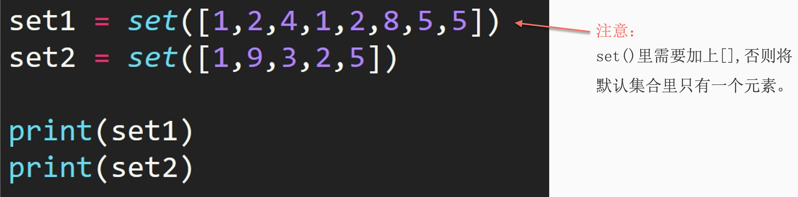
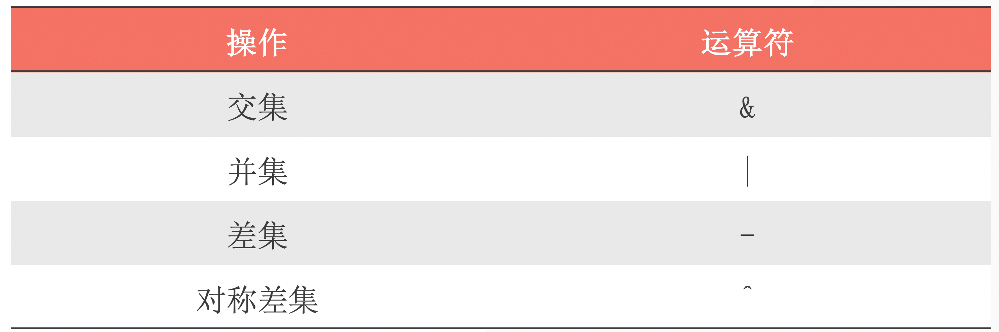
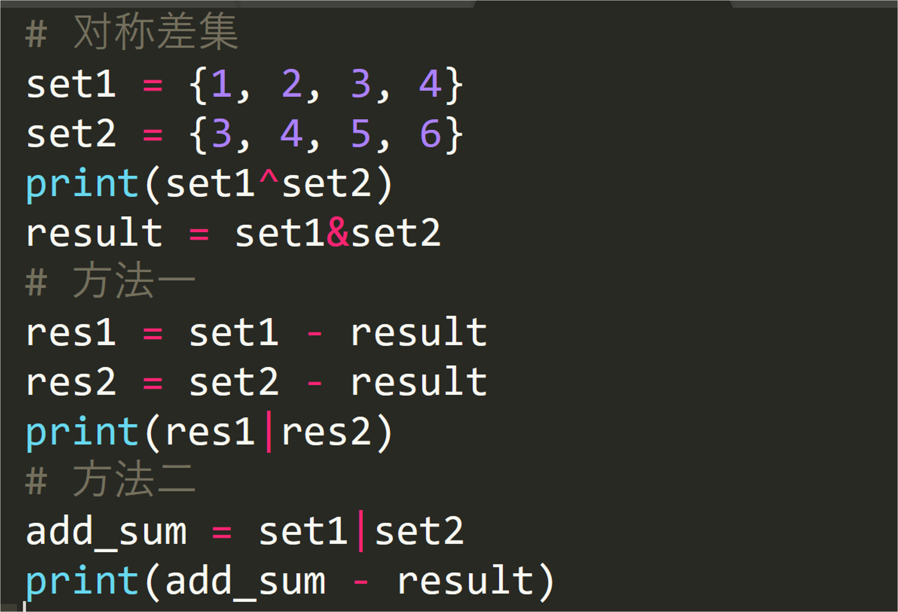

## 1. 创建集合

1. 直接用花括号创建集合

```python
set1 = {1, 2, 3, 4, 5, 6, 7, 8}
```

2. 使用 set() 方法



```python
set1 = set([1, 2, 3, 4, 5, 6, 7, 8])
set2 = set([2, 5, 7, 8, 9])
print(set1)
print(set2)
#---output---
{1, 2, 3, 4, 5, 6, 7, 8}
{2, 5, 7, 8, 9}
```

## 2. 集合的交集

交集（intersection）：求两个集合中都出现的元素，用 & 运算符实现

```python
set1 = set([1, 2, 3, 4, 5, 6, 7, 8])
set2 = set([2, 5, 7, 8, 9])
print(set1 & set2)
#{8, 2, 5, 7}
```

## 3. 集合的并集

并集（union）：求两个集合中共有的元素。用 ｜运算符实现

```python
set1 = set([1, 2, 3, 4, 5])
set2 = set([2, 5, 7, 8, 9])
print(set1 | set2 )
#{1, 2, 3, 4, 5, 7, 8, 9}
```

## 4. 集合的差集

差集（difference）：求 set1 和 set2 的差集时，会返回在 set1 中但不在 set2 中的元素。 用 — 运算符实现

```python
set1 = set([1, 2, 3, 4, 5])
set2 = set([2, 5, 7, 8, 9])
print(set1 - set2 )
# {1, 3, 4}
```

## 5. 集合的对称差集

对称差集（Symmetric Difference）： 求 set1 和 set2 的对称差集时，会返回在 set1 中或在 set2 中， 但不同时存在于两个集合中的元素。 用 ^ 运算符实现。

```python
set1 = set([1, 2, 3, 4, 5])
set2 = set([2, 5, 7, 8, 9])
print(set1 ^ set2)
# {1, 3, 4, 7, 8, 9}
```



思考🤔：对称差集可以用其他三种集集合操作来实现吗？如何实现

```python
set1 = set([1, 2, 3, 4, 5])
set2 = set([2, 5, 7, 8, 9])
print((set2 | set1) - (set2 & set1))
#{1, 3, 4, 7, 8, 9}
```

