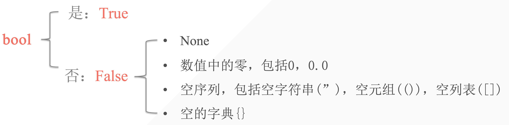
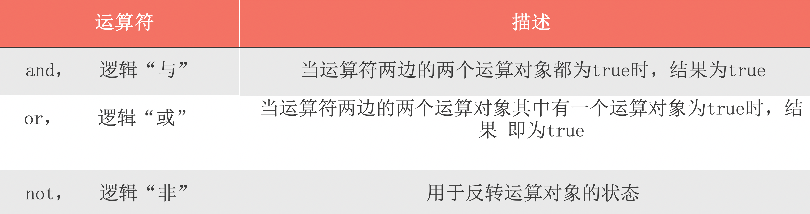
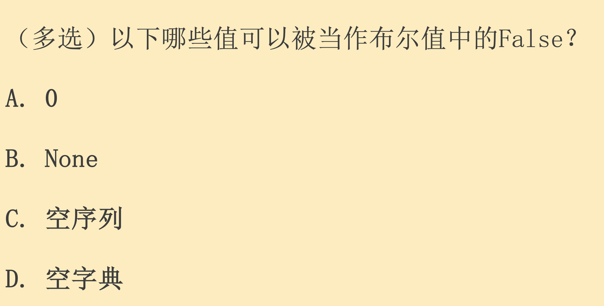

## 1.布尔值的意义

用于表示判断中的是与否。一般用于条件测试当中

```python
In [1]: a = True

In [2]: print(a)
True

In [3]: 10<5
Out[3]: False

```



## 2. 逻辑运算

逻辑运算符：用于检测两个或两个以上的条件是否满足。

逻辑运算只存在在布尔类型中



```python

In [4]: True and False
Out[4]: False

In [5]: True or False
Out[5]: True

In [6]: True and False or True
Out[6]: True

In [7]: True or True
Out[7]: True

In [8]: False or False or not False
Out[8]: True
```

```python
3 and 5    
# True and True => True => 5
3 or 5
# True or True => True => 3
#当地一个符合条件时第二个将不会被执行
5 or（10 / 0）
True
0 or 5
# False or True => True => 5
3 and not 5
# True and False => False
```

## 3. 表达式的应用–条件测试

- 检查当前变量是否与一个特殊值相等/不相等
- 比较数字的大小
- 检查特定值是否在序列里

### 3.1使用and检查多个条件

```python
In [10]: age_Amy = 17

In [11]: age_Kim = 18

In [12]: age_Kim >= 18 and age_Amy >= 18
Out[12]: False

In [13]: age_Kim >= 15  and age_Amy >= 15
Out[13]: True

```

### 3.2 使用or检查多个条件

```python
In [14]: age_Amy >= 18 or age_Kim >= 15
Out[14]: True

In [15]: age_Amy >= 20 or age_Kim >= 20
Out[15]: False

```



Select All!