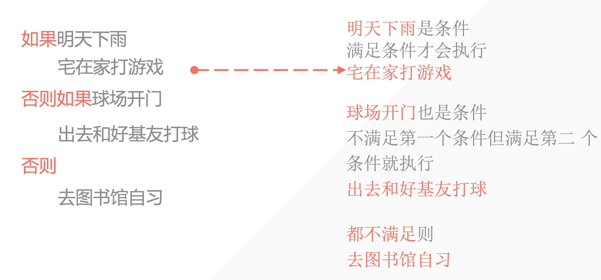
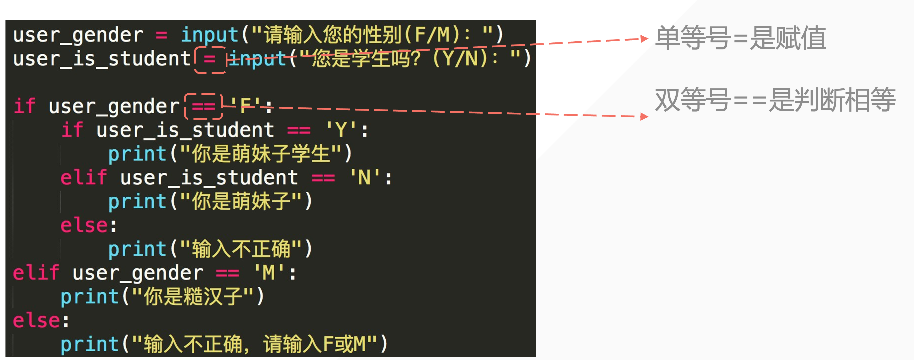

## python代码缩进问题

用四个空格或者一个tab表示缩进都可以，但不要混用。

相同位置表示他们是同一个代码块

```python
while True:
 if True:
        print('hhhh')
 print('bo')
```




```python
user_gender = input("Please input your gender(F/M) : ")
if user_gender == 'F':
    print("Your are a girl")
elif user_gender == 'M':
    print("your are a boy")
else:
    print("Error! please input F/M")
```

判断用户输入的是奇数还是偶数

```python
user_number = int(input("Please input a number : "))
if user_number % 2 == 0:
    print("It's an even number")
else:
    print("it's an odd number")
```

::: warning

判断使用双等号 ==



:::

```python
user_gender = input("Please input your gender(F/M) : ")
user_is_student = input("Are you a student? (Y/N) : ")
if user_gender == 'F':
    if user_is_student == 'Y':
        print("Your are a female student")
    elif user_is_student == 'N':
        print("Your are a girl")
    else:
        print("something wrong")    
elif user_gender == 'M':
    print("your are a boy")
else:
    print("Error! please input F/M")
```

## 小试牛🔪

### 1. **题目：** 编写一个程序来判断一个年份是否是闰年。用户输入一个年份，程序则判断并打印出该年份是不是闰年。

**规则：**
- 一个年份是闰年，如果它能被4整除，但不能被100整除；
- 如果一个年份能被100整除，它只有在也能被400整除的情况下才是闰年。

**要求：**
1. 程序应该提示用户输入一个年份。
2. 使用 `if` 语句来判断这个年份是否满足上述闰年的条件。
3. 根据判断结果打印出相应的消息，例如“XXXX年是闰年”或“XXXX年不是闰年”。

```python
user_year = int(input("Please enter a year: "))
if user_year % 4 == 0 and user_year % 100 != 0 :
    print("这是一个闰年")
elif user_year % 100 == 0 and user_year % 400 != 0:
    print("这是一个闰年")
else:
    print("这不是一个闰年")
```

### 2. **题目：** 编写一个程序来模拟简单的自动售货机。该程序首先提示用户选择一种饮料，然后根据用户的选择来确定价格。最后，程序要求用户输入付款金额，以确定是否足够支付饮料，并给出相应的找零金额或提示额外需要支付的金额。

**饮料及其价格：**
- 咖啡：$3
- 茶：$2
- 水：$1

**要求：**
1. 程序提示用户选择饮料（咖啡、茶或水）。
2. 根据用户的选择，程序显示该饮料的价格。
3. 然后程序提示用户输入支付的金额。
4. 使用嵌套的 `if` 语句来判断用户的支付是否足够。如果足够，则计算并显示找零金额；如果不足，则显示额外需要支付的金额。
5. 程序应包含对用户输入的有效性检查（例如，确保输入的是数字，选择的饮料是有效选项等）。

::: code-tabs

@tab personal-code

```python
tip_message = int(input("please choose a type of drink: \n1.coffee ($3)\n2.tea ($2)\n3.water ($1)\n(enter code): "))
if tip_message == 1:
    print("The price of the drink is $3")
elif tip_message == 2:
    print("The price of the drink is $2")
else:
    print("The price of the drink is $1")
tip_message_2 = int(input("Please enter the money you pay: "))
if tip_message_2 >= tip_message:
    print(f"Approved! Your charge is ${tip_message_2 - tip_message}")
else:
    print(f"Sorry, you still need ${tip_message - tip_message_2}")

```

@tab teacher’s code

```python
# 自动售货机程序

# 显示饮料选择
print("请选择一种饮料：")
print("1. 咖啡 ($3)")
print("2. 茶 ($2)")
print("3. 水 ($1)")

# 用户选择饮料
choice = input("请输入您的选择（1-咖啡，2-茶，3-水）: ")

# 检查用户输入是否有效  #Python valuein sequence
if choice in ['1', '2', '3']:
    # 根据选择设置价格
    if choice == '1':
        price = 3
    elif choice == '2':
        price = 2
    else:
        price = 1

    print(f"您选择的饮料价格是：${price}")

    # 用户支付
    payment = float(input("请输入您的支付金额: $"))

    # 检查支付金额是否足够
    if payment >= price:
        # 计算找零
        change = payment - price
        print(f"支付成功！您的找零是: ${change:.2f}")
    else:
        # 显示不足金额
        shortage = price - payment
        print(f"支付金额不足。您还需要支付: ${shortage:.2f}")
else:
    print("无效选择，请输入1，2或3。")
```

```python
