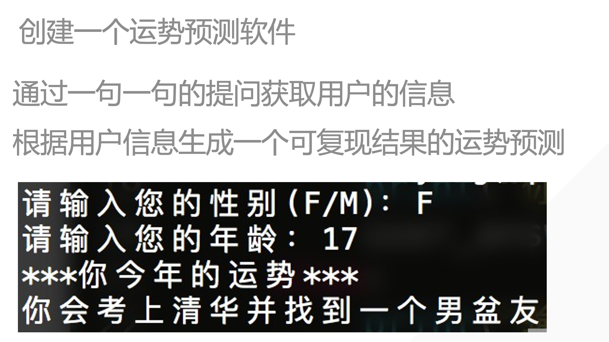

## 1. for循环

```python
lst = [1, 2, 3, 4, 5, 6, 7, 8, 9]
for number in lst:
    print (f"{number}: {number*'*'}")
```

```python
lst = [1, 2, 3, 4, 5, 6, 7, 8, 9]
new_lst = []
for number in lst:
    new_lst.append(number**2)
print(new_lst)
```

## 2. range

```python
for i in range (10)
    print(i)
```

是一个左闭右开的范围，所以会print 0-9 不会print10

```python
lst = []
for i in range(101):
    lst.append(i)
print(lst)
```

print一个从0到100的列表

### 2.1 range的使用

```python
range = (0, 10, 2)
        开始 结束 间隔
```

创建一个列表，放置1到10之间的偶数

```python
lst = []
for i in range(0, 10, 2):
    lst.append(i)
print(lst)
##[0, 2, 4, 6, 8]

```

### 2.2 通过索引遍历序列元素

```python
student_list = ['小红', '小兰', '小花']
for index in range(len(student_list)):
    print(student_list[index])
```

适用于两个列表对应的查找，通过 for 循环获取第一个列表元素的下标来 print 第二个列表对应位置的数据。

## 3. break跳出循环

跳出循环语句，不执行下面的循环

```python
for i in range(10):
    print(i)
    if i > 5:
        break
# 从结果逆推， 6>5, break，所以会print0到6
```

```python
i = 0
while True:
    print(i)  # i = 5
    i = i + 1  # 6 = 5 + 1
    if i > 5: # 6>5
        break
#print 0到5
```

## 4.pass

pass没用作用，是一个占位语句

```python
while True:
    pass
```




```python
gender = input("请输入您的性别（F/M）：")
age = int(input("请输入您的年龄： "))
if gender == 'F':
    if age > 15:
        print("你今年会考上清华并且找到男朋友")
    else:
        print("你会考上清华，好好学习！")
if gender == 'M':
    if age > 15:
        print("你今年会考上清华并且找到女朋友")
    else:
        print("你会考上清华，好好学习！")
```

