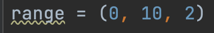

## 1. for循环

```python
student_list = ['小红', '小兰', '小花']
for student in student_list:
    print(student)
```

```python
lst = [1, 2, 3, 4, 5, 6, 7, 8, 9]
for number in lst:
    print (f"{number}: {number*'*'}")
```

```python
lst = [1, 2, 3, 4, 5, 6, 7, 8, 9]
new_lst = []
for number in lst:
    new_lst.append(number**2)
print(new_lst)
```

## 2. range

```python
for i in range (10)
    print(i)
```

是一个左闭右开的范围，所以会print 0-9 不会print10

```python
lst = []
for i in range(101):
    lst.append(i)
print(lst)
```

print一个从0到100的列表

### 2.1 range的使用



​                                                                                                                    开始           结束            间隔
