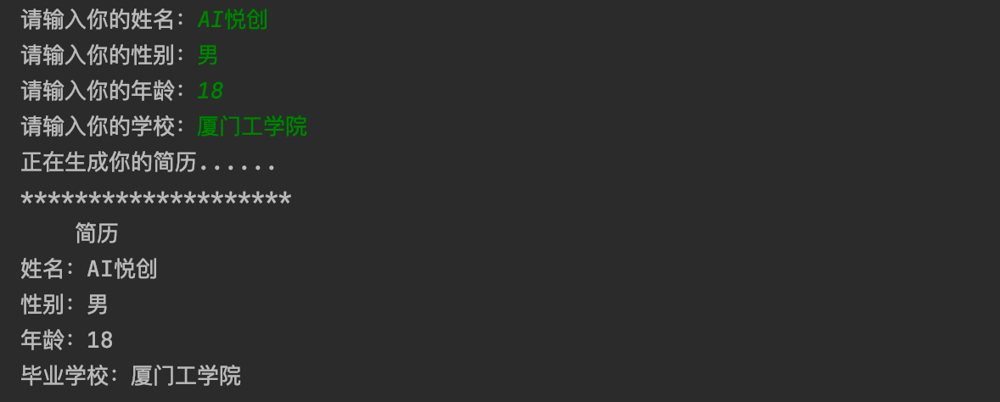

---
通过一句一句的提问获取用户的信息，生成一个格式化的简历。

**如例：**



```python
name = input("请输入你的姓名： ")
gender = input("请输入你的性别： ")
age = input("请输入你的年龄： ")
school = input("请输入你的学校： ")
print("is processing......")
print("    简历     ")
print(f"姓名： {name}")
print(f"性别： {gender}")
print(f"年龄： {age}")
print(f"就读学校： {school}")

#---output---
请输入你的姓名： Cindy
请输入你的性别： female
请输入你的年龄： 17
请输入你的学校： Cambridge
is processing......
    简历     
姓名： Cindy
性别： female
年龄： 17
就读学校： Cambridge
```

