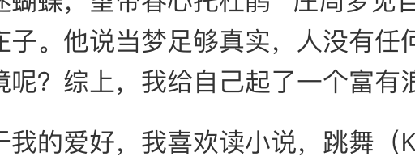

## 介绍页

咳咳，虽然想说的话不是很多，但还是简单介绍一下我～～

我是王若伊晗。是这个博客的主人，你也可以叫我蝶梦，这个名字来源于一首诗中的哲学典故----“庄生晓梦迷蝴蝶，望帝春心托杜鹃”  庄周梦见自己便成了蝴蝶，从喧嚣的人生走向逍遥之境，而梦醒发现自己还是庄子。他说当梦足够真实，人没有任何能力知道自己是否是在做梦，那我们呢？我们是否能分清现实和梦境呢？综上，我给自己起了一个富有浪漫主义色彩的笔名——“蝶梦”。

关于我的爱好，我喜欢读小说，跳舞（K-pop）和旅行，并热衷于交很多很多的朋友......

现在的我是剑桥大学工程专业的一名学生，主修电磁学，电路分析，机械学，结构力学，数学，材料学和流体力学。对于未来的就业方向还有点迷茫，还在努力摸索中......

那就先说这么多吧，等想到了再补上！

<PDF url="/pdf/IEP-Report.pdf" />

## 二级标题

::: md-demo

```python
print("hello")
```



:::

